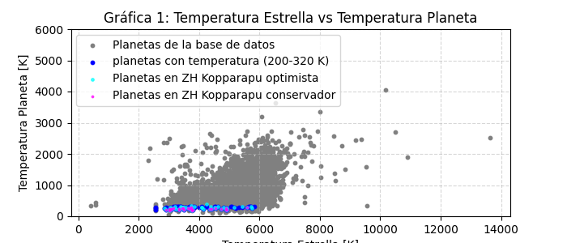
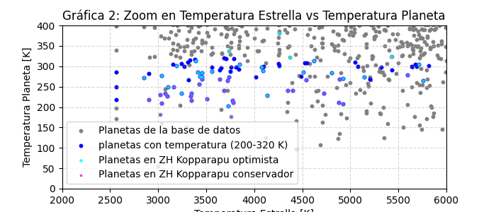

# Proyecto 2: Arquitectura Planetaria y la Búsqueda de “Tierra 2.0”

## Problema:

No todos los planetas orbitan estrellas como nuestro Sol. Muchos orbitan enanas rojas frías o estrellas gigantes calientes. Queremos descubrir qué tipos de telescopios y métodos de descubrimiento son más eficientes para encontrar exoplanetas pequeños (rocosos) que existan en zonas donde el agua podría ser líquida.

El Filtro de Habitabilidad: "Mundos Rocosos Templados": Temperatura de equilibrio (pl_eqt) entre 200 K y 320 K, y Radio (pl_rade) menor a 2.5 radios terrestres.

Investiga cuántos planetas descubrió el telescopio terrestre “TRAPPIST-South”.

## Toma de datos

A la fecha de verificar la consulta (27 abril 2026) la NASA reporta 6273 exoplanetas descubiertos [1], la consulta obtenida inicialmente con el ADQL fue:

```sql
SELECT pl_name, discoverymethod, disc_facility, pl_rade, pl_eqt, pl_orbsmax, st_teff, st_lum
FROM ps
WHERE pl_rade IS NOT NULL AND pl_eqt IS NOT NULL
ORDER BY pl_name
```

retorna 17070 datos, siendo casi el triple de los exoplanetas reales descubiertos, evidenciando la duplicidad de los objetos, esto es debido a que cada fila de datos corresponde a un paper que trabajó sobre el exoplaneta y los datos encontrados, para esto no se usará entonces la tabla ps, sino la tabla PSCompPars que presenta el consenso de los datos de los planetas [2]. Usando el siguiente ADQL:

```sql
SELECT pl_name, discoverymethod, disc_facility, pl_rade, pl_eqt, pl_orbsmax, st_teff, st_lum
FROM PSCompPars
```

Con este cambio se obtiene un total de 6273 exoplanetas, que es el valor exacto de los planetas descubiertos que reporta la NASA. (Nota: si este valor se verifica en una fecha posterior, estos números pueden variar). Ahora se trae solo los datos que no tengan ni radio ni temperatura de equilibrio nula obteniendo un total de 4661 exoplanetas:

```sql
SELECT pl_name, discoverymethod, disc_facility, pl_rade, pl_eqt, pl_orbsmax, st_teff, st_lum
FROM PSCompPars
WHERE pl_rade IS NOT NULL
AND pl_eqt IS NOT NULL
ORDER BY pl_name
```

Para este proyecto se consideran los exoplanetas pequeños como aquellos con radio menor a $2.5 R_{\oplus}$, aunque esto no garantiza composición rocosa, este dato se comprobó en el trabajo del primer mes, ya que podrían ser también mini-Neptunos.

# Método

Este proyecto tiene como objetivo encontrar exoplanetas pequeños que podrían tener condiciones compatibles con la existencia de agua líquida. Para esto se aplica primero el filtro propuesto en el ejercicio: temperatura de equilibrio entre 200 K y 320 K, y radio menor que $2.5R_\oplus$.

Este filtro permite identificar exoplanetas pequeños y templados, aunque este radio no garantiza que todos sean realmente rocosos. Un planeta con radio menor que $2.5R_\oplus$ puede ser rocoso, pero también podría ser un mini-Neptuno (Esto se evidenció en el proyecto del primer mes).

Además del filtro simple de temperatura, este trabajo compara los candidatos con la zona habitable calculada por Kopparapu. Este modelo estima los límites interno y externo de la zona habitable usando el flujo estelar efectivo, la luminosidad de la estrella y la distancia orbital del planeta. Por esta razón, el criterio de Kopparapu no depende solamente de la temperatura de equilibrio del planeta.

El modelo de Kopparapu considera planetas tipo Tierra bajo un modelo climático 1D radiativo-convectivo, sin nubes. Cerca del límite interno se considera una atmósfera rica en vapor de agua, mientras que cerca del límite externo se considera una atmósfera rica en $CO_2$. Además, este modelo aplica para estrellas con temperatura efectiva entre 2600 K y 7200 K.[3]

| Límite                     | Tipo                   |
| -------------------------- | ---------------------- |
| Venus reciente (RV)        | Optimista (interior)   |
| Invernadero desbocado (RG) | Conservador (interior) |
| Invernadero húmedo (MG)    | Conservador (interior) |
| Máximo invernadero (MaxG)  | Conservador (exterior) |
| Marte temprano (EM)        | Optimista (exterior)   |

Para calcular la distancia ($d$) a la que se encuentra el límite, se usan las siguientes ecuaciones [3]:

$$T_\star= T_{\rm eff} - 5780$$

$$S_{\rm eff}=S_{\rm eff,\odot}+aT_\star+bT_\star^2+cT_\star^3+dT_\star^4$$

$$d=\sqrt{(L_\star/L_\odot)/S_{\rm eff}}$$
En los datos de la NASA, `st_lum` representa $\log_{10}(L_\star/L_\odot)$, por eso se transforma como $L_\star/L_\odot = 10^{st\_lum}$

Los valores correspondientes a las variables $S_{eff,⊙}$, $a$, $b$, $c$, $d$ dependen de cuál límite se está calculando y se expresa en la siguiente tabla [4]:

| Límite                     | $S_{eff,⊙}$ | a           | b           | c             | d             |
| -------------------------- | ----------- | ----------- | ----------- | ------------- | ------------- |
| RV (Venus reciente)        | 1.7763      | 1.4335×10⁻⁴ | 3.3954×10⁻⁹ | −7.6364×10⁻¹² | −1.1950×10⁻¹⁵ |
| RG (Invernadero desbocado) | 1.0385      | 1.2456×10⁻⁴ | 1.4612×10⁻⁸ | −7.6345×10⁻¹² | −1.7511×10⁻¹⁵ |
| MG (Invernadero húmedo)    | 1.0146      | 8.1884×10⁻⁵ | 1.9394×10⁻⁹ | −4.3618×10⁻¹² | −6.8260×10⁻¹⁶ |
| MaxG (Máximo invernadero)  | 0.3507      | 5.9578×10⁻⁵ | 1.6707×10⁻⁹ | −3.0058×10⁻¹² | −5.1925×10⁻¹⁶ |
| EM (Marte temprano)        | 0.3207      | 5.4471×10⁻⁵ | 1.5275×10⁻⁹ | −2.1709×10⁻¹² | −3.8282×10⁻¹⁶ |

# Análisis

## Métodos de detección

Se realiza un filtro para seleccionar planetas rocosos pequeños ($R < 2.5R_\oplus$) y templados ($200K \leq T \leq 320K$). Con este filtro se obtiene:

| Método de descubrimiento  | Radio prom $\overline{R_{\oplus}}$ | Cant. de planetas | %     |
| ------------------------- | ---------------------------------- | ----------------- | ----- |
| Radial Velocity           | 1.630118                           | 17                | 19.77 |
| Transit                   | 1.813176                           | 67                | 77.91 |
| Transit Timing Variations | 1.268500                           | 2                 | 2.33  |

Se observa que el método de tránsito es el más usado para encontrar planetas rocosos pequeños y templados, con el 77.91 % de los planetas detectados. Le sigue el método de velocidad radial con el 19.77 %, mientras que las variaciones en tiempo de tránsito son el 2.33 %. Esto muestra que el tránsito sigue siendo el método que domina la detección de exoplanetas.

Ahora se realiza el análisis por telescopio:

| Instalación / telescopio                     | Método de descubrimiento  | cantidad | %     |
| -------------------------------------------- | ------------------------- | -------- | ----- |
| Kepler                                       | Transit                   | 44       | 51.16 |
| Transiting Exoplanet Survey Satellite (TESS) | Transit                   | 11       | 12.79 |
| K2                                           | Transit                   | 7        | 8.14  |
| Multiple Observatories                       | Radial Velocity           | 6        | 6.98  |
| Calar Alto Observatory                       | Radial Velocity           | 4        | 4.65  |
| La Silla Observatory                         | Radial Velocity           | 4        | 4.65  |
| Multiple Facilities                          | Radial Velocity           | 2        | 2.33  |
| Multiple Observatories                       | Transit                   | 2        | 2.33  |
| European Southern Observatory                | Radial Velocity           | 1        | 1.16  |
| La Silla Observatory                         | Transit                   | 1        | 1.16  |
| MEarth Project                               | Transit                   | 1        | 1.16  |
| Multiple Observatories                       | Transit Timing Variations | 1        | 1.16  |
| SPECULOOS Southern Observatory               | Transit                   | 1        | 1.16  |
| Transiting Exoplanet Survey Satellite (TESS) | Transit Timing Variations | 1        | 1.16  |

La instalación con mayor número de exoplanetas pequeños y templados es Kepler, con 44 descubrimientos, que corresponde al 51.16 % del total. Le siguen TESS, con 11 candidatos, y K2, con 7 candidatos. Esto muestra que los telescopios que hacen búsqueda basadas en el método de tránsito, principalmente los espaciales, han sido las más eficientes para encontrar candidatos tipo “Tierra 2.0”.

En el ranking por `Instalación / telescopio`, TRAPPIST-South no aparece explícitamente como instalación independiente. Sin embargo, al buscar los planetas cuyo nombre contiene `TRAPPIST`, aparecen 7 planetas correspondientes al sistema TRAPPIST-1. Por esto, en este trabajo se reporta que TRAPPIST-South está asociado al descubrimiento del sistema TRAPPIST-1. Además, 3 de los 7 planetas tienen como disc_facility el Observatorio La Silla, donde se encuentra el telescopio TRAPPIST-South. TRAPPIST-1 es uno de los sistemas planetarios más estudiados y varios de sus planetas se encuentran dentro de la zona habitable de esta estrella.

## Habitabilidad de los exoplanetas rocosos pequeños

En este trabajo se compara la habitabilidad simple dada por un rango de temperatura de equilibrio del planeta con los límites conservadores y optimistas dados por Kopparapu.

La siguiente gráfica muestra todos los planetas encontrados destacando sobre ellos los 3 filtros de habitabilidad para este trabajo.



La gráfica 2 es un zoom a los datos dónde se encuentran los candidatos de las zonas habitables.


# Resultados

La siguiente tabla resume los resultados obtenidos por los 3 métodos:

| Categoría                  | Cantidad | T° estrella mín. (K) | T° estrella máx. (K) | T° planeta mín. (K) | T° planeta máx. (K) |
| -------------------------- | -------- | -------------------- | -------------------- | ------------------- | ------------------- |
| Planetas templados rocosos | 86       | 2566                 | 5818                 | 202                 | 320                 |
| HZ Kopparapu (optimista)   | 55       | 2850                 | 5757                 | 177                 | 381                 |
| HZ Kopparapu (conservador) | 28       | 2900                 | 5596                 | 177                 | 279                 |

Se observa que los planetas seleccionados por el modelo de Kopparapu no tienen exactamente el mismo rango de temperatura que el filtro básico de 200 K a 320 K. Esto se debe a que el modelo de Kopparapu se basa principalmente en el flujo estelar, la luminosidad de la estrella, la distancia orbital y supuestos atmosféricos, no solo en la temperatura de equilibrio del planeta.

Ahora analicemos los tipos de estrellas en las que aparecen estos planetas con condiciones habitables. La siguiente tabla muestra las estrellas de secuencia principal y su porcentaje de la secuencia principal[5]:

| Clase | Temperatura (K) | Color convencional    | Fracción de la secuencia principal |
| ----- | --------------- | --------------------- | ---------------------------------- |
| O     | ≥ 33000         | azul                  | ~0.00003 %                         |
| B     | 10000 – 33000   | azul a blanco azulado | 0.13 %                             |
| A     | 7500 – 10000    | blanco                | 0.6 %                              |
| F     | 6000 – 7500     | blanco amarillento    | 3 %                                |
| G     | 5200 – 6000     | amarillo              | 7.6 %                              |
| K     | 3700 – 5200     | naranja               | 12.1 %                             |
| M     | ≤ 3700          | rojo                  | 76.45 %                            |

Se observa que el filtro simple de temperatura incluye estrellas desde 2566 K hasta 5818 K. Recordando que al aplicar el modelo de Kopparapu y restringirlo al rango de validez de 2600 K a 7200 K, los candidatos comienzan en 2850 K para la zona optimista y en 2900 K para la zona conservadora.

En general, los exoplanetas aparecen alrededor de estrellas frías tipo M y K, y en menor medida alrededor de estrellas tipo G. Según la tabla usada, estas clases representan una gran fracción (88.55 %) de las estrellas de secuencia principal, por lo que también son las más abundantes.

# Conclusiones

Al aplicar el filtro de planetas pequeños y templados, definido por $R < 2.5R_\oplus$ y una temperatura de equilibrio entre 200 K y 320 K, se encontraron 86 candidatos dentro de la base de datos consultada. Aunque en este trabajo se les llama “rocosos pequeños”, es importante recordar que este criterio por radio no garantiza que todos tengan composición rocosa, ya que algunos podrían ser mini-Neptunos.

El método de tránsito es el más eficiente, ya que detecta el 77.91 % de los planetas rocosos pequeños y templados encontrados. Esto muestra que el tránsito sigue siendo el método dominante para buscar planetas tipo Tierra 2.0, aunque también aparece una contribución importante del método de velocidad radial con el 19.77 %.

Al analizar las instalaciones de descubrimiento, Kepler es la misión que más candidatos aporta, con 44 planetas, equivalente al 51.16 % de la muestra filtrada. Después aparecen TESS con 11 candidatos y K2 con 7 candidatos. Esto indica que las misiones espaciales basadas en el método de tránsito han sido las más efectivas para encontrar planetas pequeños en rangos de temperatura compatibles con agua líquida.

El filtro simple de temperatura de equilibrio no coincide completamente con la zona habitable calculada por Kopparapu. Esto ocurre porque el modelo de Kopparapu no depende solo de la temperatura del planeta, sino también del flujo estelar, la luminosidad de la estrella, la distancia orbital y supuestos atmosféricos. Por eso algunos planetas que están en la zona habitable de Kopparapu pueden quedar por fuera del rango 200 K – 320 K, y algunos planetas dentro de ese rango pueden no estar en la zona habitable de Kopparapu.

Los exoplanetas pequeños y templados encontrados se concentran principalmente alrededor de estrellas frías tipo M y K, y en menor medida alrededor de estrellas tipo G. Sin embargo, esto no significa que los planetas habitables solo existan alrededor de estas estrellas. Actualmente solo se han detectado 4701 de sistemas planetarios[1], mientras que Gaia DR3 contiene aproximadamente 1.8 mil millones de fuentes astronómicas, en su mayoría estrellas de la Vía Láctea [6]. Esta diferencia muestra que todavía observamos una fracción muy pequeña de la población estelar, por lo que sería un sesgo afirmar que los planetas pequeños templados solo existen alrededor de estrellas frías.

Lo que sí se puede afirmar con los datos de este trabajo es que los exoplanetas pequeños y templados descubiertos hasta ahora aparecen mayormente alrededor de estrellas frías, y que su detección depende mucho del método utilizado. En esta muestra, el método de tránsito y misiones como Kepler, TESS y K2 son las herramientas más eficientes para encontrar candidatos con condiciones compatibles con habitabilidad.

# Referencias

[1] NASA. (s.f.). Exoplanets. NASA Science Exoplanets. Recuperado el 22 de abril de 2026, de https://science.nasa.gov/exoplanets/

[2] NASA Exoplanet Archive. (2025, julio 14). Planetary systems and planetary systems composite parameters data column definitions. https://exoplanetarchive.ipac.caltech.edu/docs/API_PS_columns.html

[3] Kopparapu, R. K., Ramirez, R., Kasting, J. F., Eymet, V., Robinson, T. D., Mahadevan, S., Terrien, R. C., Domagal-Goldman, S., Meadows, V., & Deshpande, R. (2013). Habitable zones around main-sequence stars: New estimates. The Astrophysical Journal, 765(2), Article 131. https://doi.org/10.1088/0004-637X/765/2/131

[4] Kopparapu, R. K., Ramirez, R., Kasting, J. F., Eymet, V., Robinson, T. D., Mahadevan, S., Terrien, R. C., Domagal-Goldman, S., Meadows, V., & Deshpande, R. (2013). Erratum: Habitable zones around main-sequence stars: New estimates. The Astrophysical Journal, 770(1), 82. https://doi.org/10.1088/0004-637X/770/1/82

[5] Wikipedia contributors. (s. f.). Clasificación estelar. En Wikipedia, la enciclopedia libre. Recuperado el 27 de abril de 2026, de https://es.wikipedia.org/wiki/Clasificaci%C3%B3n_estelar

[6] Gaia Collaboration, Vallenari, A., Brown, A. G. A., Prusti, T., de Bruijne, J. H. J., Arenou, F., Babusiaux, C., Biermann, M., Creevey, O. L., Ducourant, C., Evans, D. W., Eyer, L., Guerra, R., Hutton, A., Jordi, C., Klioner, S. A., Lammers, U. L., Lindegren, L., Luri, X., ... Walton, N. A. (2023). Gaia Data Release 3: Summary of the content and survey properties. Astronomy & Astrophysics, 674, A1. https://doi.org/10.1051/0004-6361/202243940
